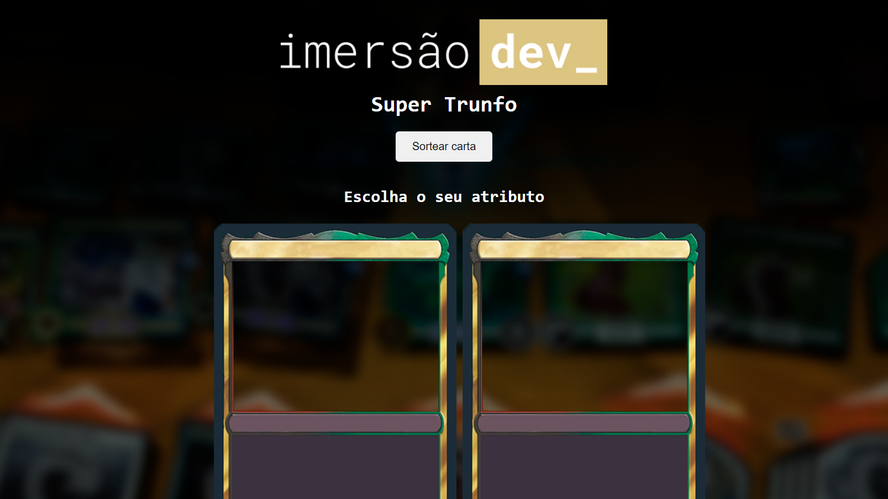

<h1 align="center"> Imersão Dev </h1>

Evento exclusivo e gratuito, promovido pela Alura para ensino de tecnologias WEB.

  <a href="#-tecnologias">Tecnologias</a>&nbsp;&nbsp;&nbsp;|&nbsp;&nbsp;&nbsp;
  <a href="#-projeto">Projeto</a>

 

  

 

## 🔗 Link acesso ao site
- <a href="https://danilofelicio.github.io/ImersaoAlura/" target="_blank" style="font-size:20px;">Clique aqui</a>

 

## 🚀 Tecnologias

Esse projeto foi desenvolvido com as seguintes tecnologias:

- HTML e CSS
- JavaScript
- Git e Github

## 💻 Projeto

Projeto do jogo de cartas super trunfo, onde cartas são sorteadas para cada jogador. Deve-se escolher uma carta e seu atributo, onde o atributo de maior valor vence a partida.